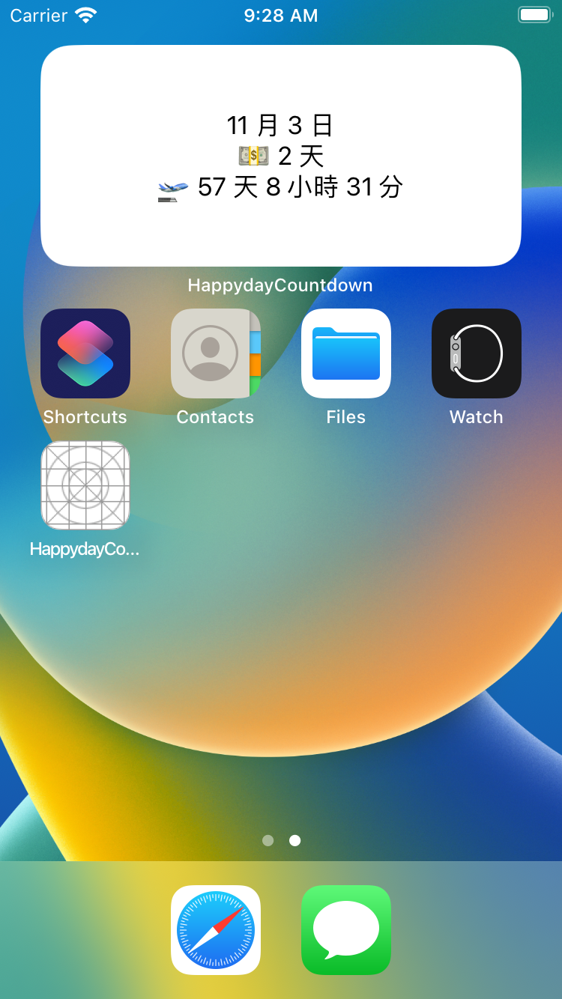
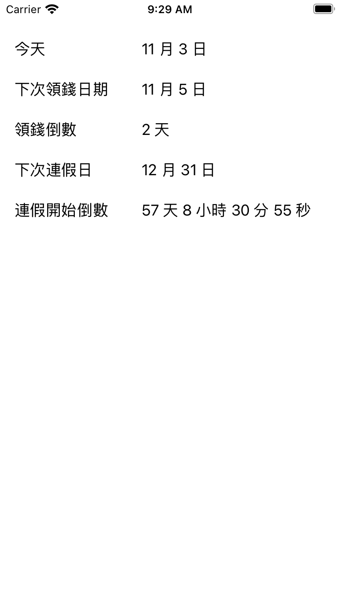

# HappydayCountdown
- 領錢日與下次連假日倒數 widget。
- Hard code 暫定發薪日為每月 5 日；下班時間為 18:00。
- 連假為 2022 年手動 hard code 日期組。（已補上 2023 年）
- 懶得做發薪日維護，也懶得做線上維護連假日，預計 2023 年先再手動更新。
- 不知道什麼時候才會繼續做動態資料維護。但要錢架 server 不可能。現在很窮。
- 歷史中的 MVVM 與現況的 RxSwift 版是實驗用。但最終還是保留 Rx 做法。
- 我要去睡了，有事 PR 托夢。

